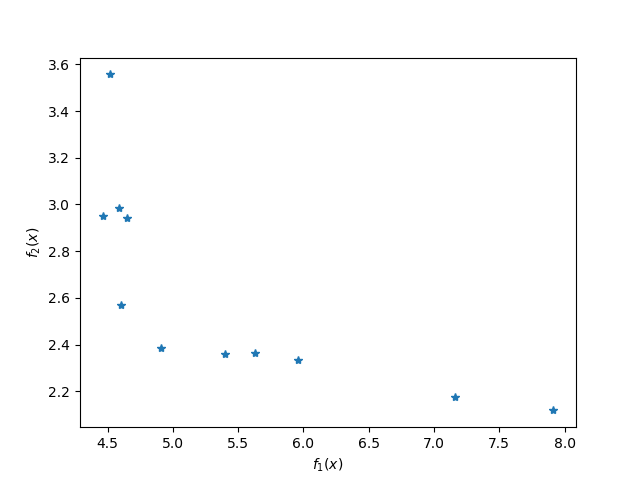
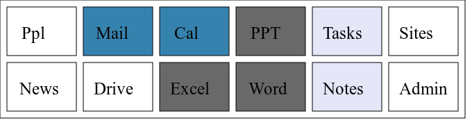
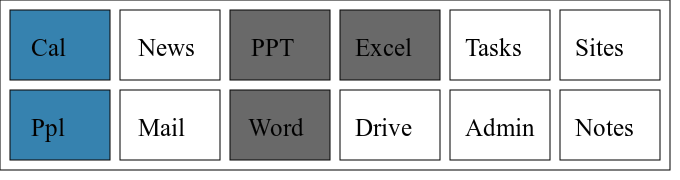
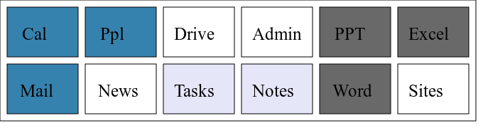
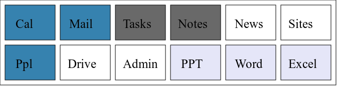

## The Problem
* \(E\) denotes the set of elements \(\{e_1,…,e_n\}\) in the menu.
* \(r\) is a positive real number denoting the time to read an element between the top of menu and target.
* \(c\) is an integer denoting the desired number of columns in the grid.
* \(d:E×E→ℝ^+\) is a distance function that measures the distance between two elements in the grid layout.
* \(w:E→ℝ^+\) denotes the weight function which
* \(a:E×E→ℝ^+\) association function
* \(x\) denotes a design candidate in the design space \(Ω\), i.e. a sequence that is a permutation of the elements of set \(E\).

Linear selection time (`Linear_ST`)

\begin{equation}
f_{1}(x) = \sum_{e∈x}  w(e) ⋅ d(e_1,e) ⋅ r
\tag{selection-time-objective}
\label{selection-time-objective}
\end{equation}

Associations between elements (`myObjective`)

\begin{equation}
f_{2}(x) = \sum_{(e_i,e_j)∈x×x} d(e_i,e_j) ⋅ a(e_i,e_j)
\tag{association-objective}
\label{association-objective}
\end{equation}

The combinatorial design problem aims to find the design that minimized the objective function.

## 1. Weighted sum multi-objective criterion
If the objective function as

\begin{equation}
f_{1}(x)+w_A f_{2}(x),
\label{objective}
\tag{objective}
\end{equation}

where \(w_A\) is a positive real number denoting the weight of the association objective, then increasing the weight \(w_A\) increases the importance of the associations between the elements, i.e. solutions in which the distance between the associated element is smaller will be favored more. Vice versa, by decreasing the value of \(w_A\), the importance of the associations between elements will decrease.

## 2. Normalization
The problem with defining the objective function like \(\eqref{objective}\), is that if the weights \(w\) are scaled by multiplying by a constant (not zero), the ratios between the weight do not change and therefore the optimal solution for only optimizing for linear selection time would not change. However, it would diminish the effect of the weight \(w_A\) and therefore the objective on the associations between the elements. Also, the weight for function \(f_1\) is set \(1\) and cannot be tuned by the designer. In order to combat this, the objective function can be normalized.

---

A quick and easy way to implement a normalization by simply normalizing the weights and associations, and not multiplying by reading time in \(\eqref{selection-time-objective}\).

---

The rigorous way to implement the normalization is to implement it as shown in [@Mausser2006].

\begin{equation}
\sum_{i=1}^k u_i θ_i f_{i}(x),
\label{normalized-objective}
\tag{normalized-objective}
\end{equation}

where \(u_i\) are the weights for which \(∑_{i=1}^k u_i = 1\) and \(u_i≥0\). The normalization factors are defined

\begin{equation}
θ_i=\frac{1}{z_i^N-z_i^U},
\end{equation}

where the coefficients are defined

\[
\begin{aligned}
x^{[i]} = \operatorname{argmin}\{f_i(x) : x∈Ω\} \\
z_i^U = f_i(x^{[i]}) \\
z_i^N = \max_{1≤j≤k} (f_i(x^{[j]})).
\end{aligned}
\]

In our case \(k=2\).

## 3. Pareto Frontier
Using \(\eqref{normalized-objective}\) the Pareto optimal designs can be obtained by solving the optimization problem for different values of the weights \(u_i\). [@Mausser2006]

Pareto frontier obtained by using values of \(u_1∈\{0, 0.1, 0.2,…,1\}\) and \(u_2 = 1 - u_1\). Because the optimization algorithm used a randomized (stochastic) search instead of deterministic algorithm, not all designs for values of \(u_1\) belong into the Pareto frontier in the figure.

Some pareto optimal designs for different values of \(u_1\) where \(u_2=1-u_1\).

As can be seen, the higher values of weight \(u_1\) prefer designs that optimize for designs that have lover selection time, whereas designs with lower values of weight \(u_1\) therefore higher values of weight \(u_2\) prefer designs that have lower distance between associated elements.

## References
