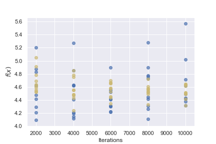
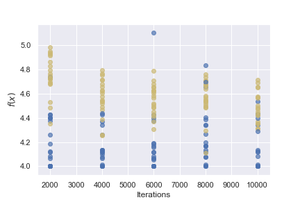
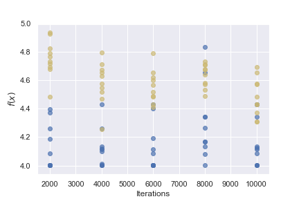
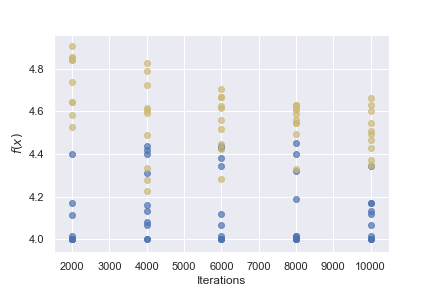

A neighboring layout is defined as a layout that if it is changed by a small amount creates a new layout such that the value of the objective function for the new layout differs by a small amount. In this case, the function for creating neighboring layouts can be achieved by swapping two elements that are within distance \(n\) of each other. Since the objective function depends heavily on the distance to the first element and distance between two elements, the change in the value of the objective function is limited by the value \(n\), and therefore small if \(n\) is small.

```python
def neighbor(layout, n=1):
    """
    Returns a neighbor of a layout (list);
    has a parameter 'n' to control distance in the neighborhood (optional)
    """
    # Choose a random element from layout.
    i = random.randrange(0, len(layout))

    # Filter all elements that have distance over n.
    canditates = []
    for j in range(len(layout)):
        if i == j:
            continue
        if distance(columns, i, j) <= n:
            canditates.append(j)

    # Choose a random element from candidate elements.
    j = random.choice(canditates)

    # Swap the elements i and j.
    new_layout = layout[:]
    new_layout[i] = layout[j]
    new_layout[j] = layout[i]
    return new_layout
```

Comparison between annealing and random search. Blue markers indicate the values of obtained from annealing and yellow markers indicate the values obtained from the random search. The value \(n\) indicates the distance of the neighborhood. The x-axis contains the number of iterations and the y-axis the obtained objective value. Ten trials were conducted for every iteration quantity.









As can be seen from the plots, annealing tends to converge to better (lower) objective values with sufficient iterations and neighborhood size compared to random search.

The deterministic element of annealing allows it to be more sophisticated and explore the neighborhood good solutions in order to find better ones rather than just relying on pure luck for finding a good solution like a random search.
