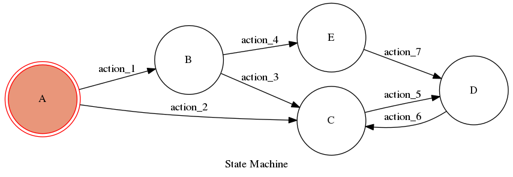

The properties of given *finite state machine (FSM)* can analyzed by analyzing the underlying *directed graph* \(G=(V,E)\) where the vertices \(V\) are the *states* and the edges \(E\) are the *transitions*. The state machine starts from some initial state \(s∈V\). A finite state machine can be implemented using Python library called [*transitions*](https://github.com/pytransitions/transitions). [@python_state_machine]

**Weak task completeness**: *Can a user find some way to reach a goal from initialization?* This property can be tested by finding a path between initial state \(s\) and some goal state \(t\) using a graph search algorithm such as depth-first search or breadth-first search. [@dfs_bfs_python]

**Visibility**: *User input is always associated with feedback.* This property can be tested by testing that the transition to all states yields some feedback. The feedback could be visual feedback or text output in the console. [@capture_stdout]

The attached code contains the test for these properties implemented in Python.

## References
