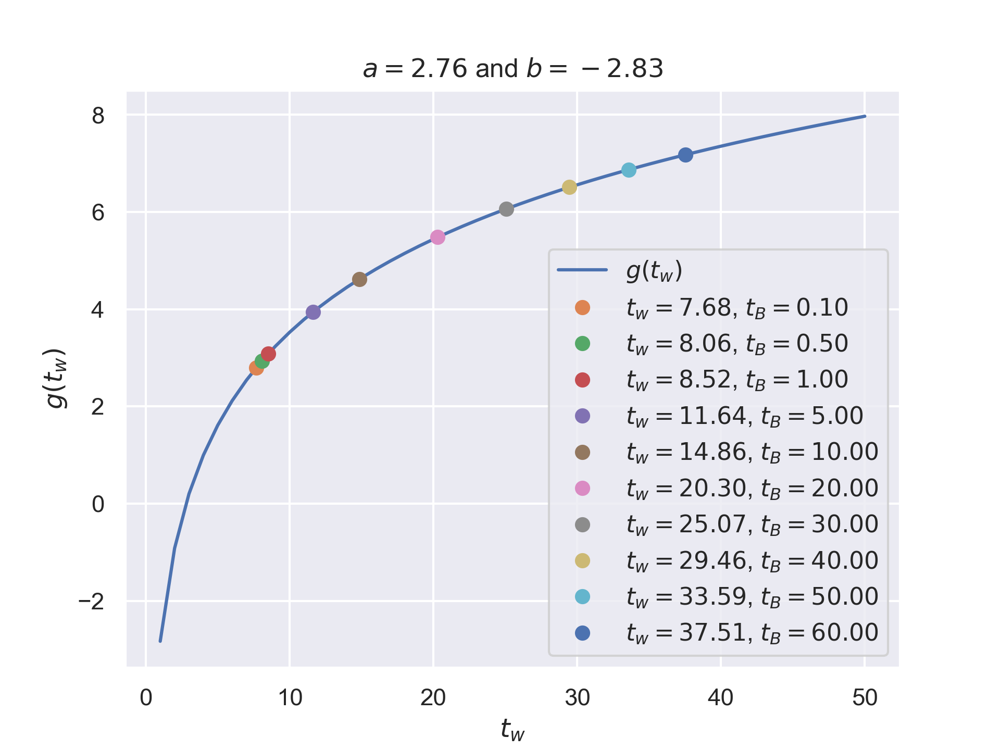
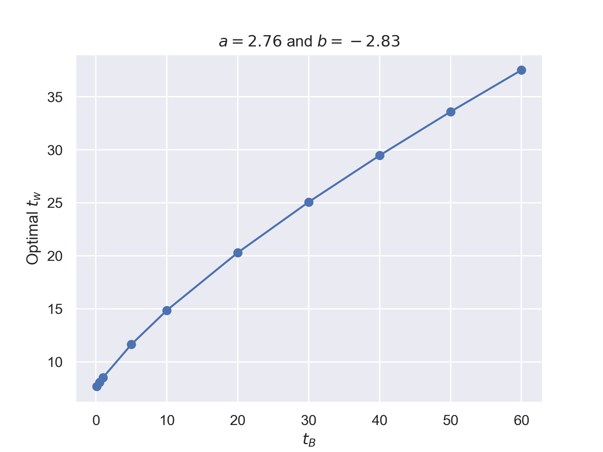

The *information foraging* model borrows concepts from optimal foraging theory in order to model information retrieval behavior for information such as such as text, video, audio or images. [@information_foraging, @glossary_hci]

---

The rate of currency intake (i.e. information) is given by Holling's Disk equation
\[
R = \frac{g(t_w)}{t_B+t_w}.
\]

1) A linear relation between the number of patches foraged and time between foraging.
2) The average time between patches \(t_B>0\).
3) Average gain per patch \(g(t)\), i.e. cumulative amount of new information encountered in search a result list.
4) Average patch processing time \(t_w>0\).

---

All pathes have the same information gain which follows logarithmic distribution
\[
g(t) = a\ln t + b
\]
where \(a\) and \(b\) are real numbers. The optimal amount of time \(t_w\) that should be spent foraging per patch can be solved from the equation
\[
\begin{aligned}
R(t_w) &= \frac{d}{dt_w} g(t_w) \\
\frac{a\ln t_w + b}{t_B+t_w} &= \frac{a}{t_w} \\
\frac{a\ln t_w + b}{t_B+t_w} - \frac{a}{t_w} &= 0 \\
a t_w \ln t_w + b t_w - a t_w - a t_B &= 0
\end{aligned}
\]

Given some numerical values for the constants \(a\) and \(b\), the root can be solved using Newton's method.

## Results

The patch model was used to obtain the optimal foraging times \(t_w\) for given values of \(a\), \(b\) and \(t_B\).

## References
