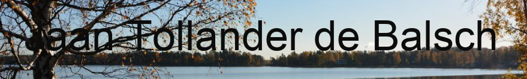
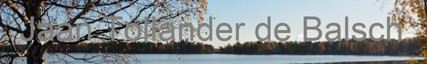
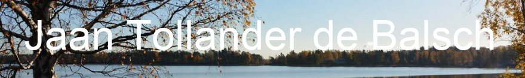
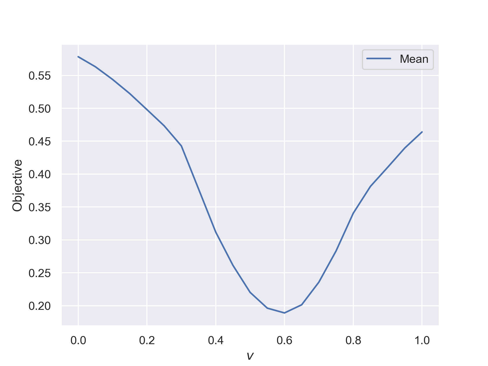

## The Problem
This report explores how changing the color of  title text placed within a header image effects the saliency map, i.e. which elements stand out. Optimally the header text should stand out, while the header image should be recognizable. Such designs can often be found in website and blogs, such as [my blog](jaantollander.com).

1) **Design variable**: The color of the header text. This report used colors from grayscale color set. Grayscale color can be represented as a value \(v∈[0, 1]\). Value \(v=0.0\) corresponds to black and \(v=1.0\). There are many other potential design varibles that could be used such as the changing brightness or contrast to the image, or adding shadow to the image, but these are not explored in this report. [@make_text_stand_out]

2) **Objective function**: The header text should *stand out* from the image. In the saliency map, lighter values indicate higher saliency, i.e. the the pixel *stands out* more. The objective function can be evaluated by acquiring the values of the pixels occupied by the text in the saliency map and then using some metric on them, such as mean value, which would measure how well the text stands out on average.

3) **Task Instance**: An example of an task instance can be seem in figures.

4) **The algorithm**: The algorithm was inspired by the interface metrics presented in *Aalto Interface Metric (AIM)* by @aim_aalto_interface_metrics_service, which can measure the saliency of a image among other metrics. Instead of using the same algorithm for saliency as AIM, this algorithm uses OpenCV and its Python bindings for the saliency detection  as done by @opencv_saliency_detection.

    The following figures display a task instance for given header text color \(v\) and the corresponding saliency map.

    
    

    \(v=0.0\)

    
    

    \(v=0.5\)

    
    

    \(v=1.0\)

## Results

The resulting graph using grayscale colors \(v∈\{0.0, 0.05, 0.1, …, 1.0\}\) and measuring the mean value of the saliency of the text. Higher values indicate that the text was more salient and lower values indicate that it was less salient. As can be seen, using black color for the text produces is on average, most salient of the colors for the chosen header image.

## References
