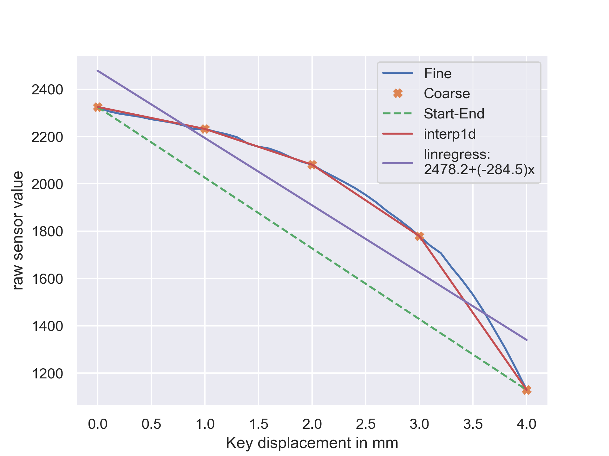

In order to calibrate the sensor to have a linear transfer function, a linear model must be fitted to the coarse sensor data as displayed in the figure \ref{data}. The two linear models displayed in figure \ref{data} are a linear interpolation between start and end points, linear interpolation between all coarse data points and linear regression model fitted into all coarse data points. Compared to each other, the interpolation between start and end points yields a model that is single linear line, but doesn't take into account the information from the other points. On the other hand interpolation between all points taking into account all the points, yields a model that consists of many lines, which isn't desirable if only one line is required. The correct way to fit one line into the data is to use regresssion, which fits linear model (single line) to all data points by minimizing the square error of the models predictions.

- Linear interpolation:  [`scipy.interpolate.interp1d`](https://docs.scipy.org/doc/scipy/reference/generated/scipy.interpolate.interp1d.html#scipy.interpolate.interp1d)
- Linear regression:  [`scipy.stats.linregress`](https://docs.scipy.org/doc/scipy/reference/generated/scipy.stats.linregress.html)
