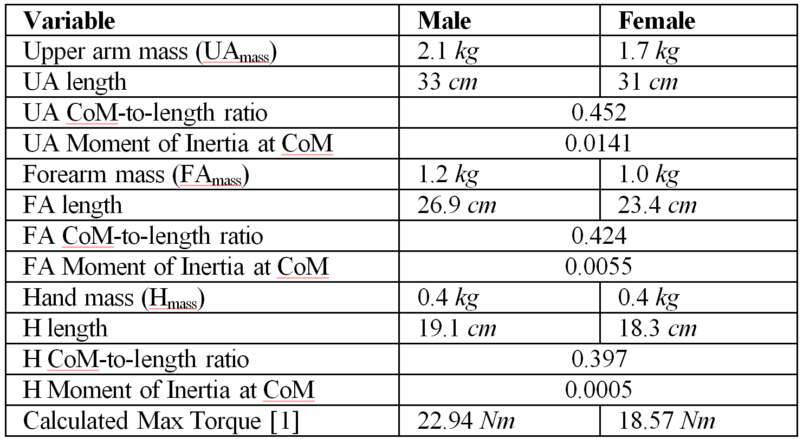
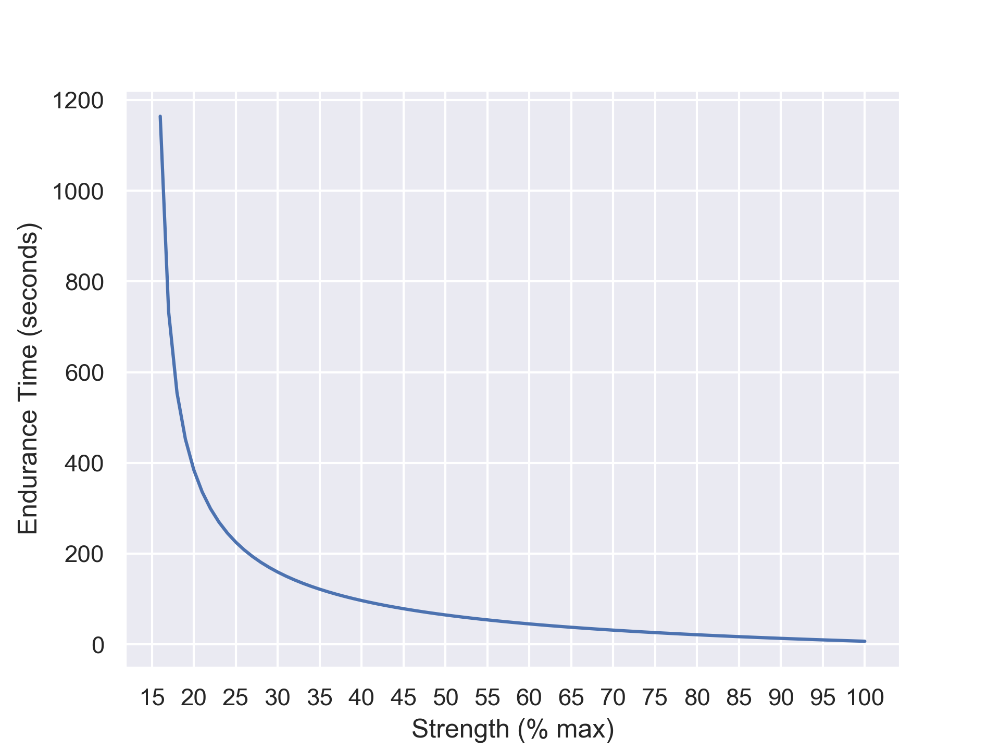
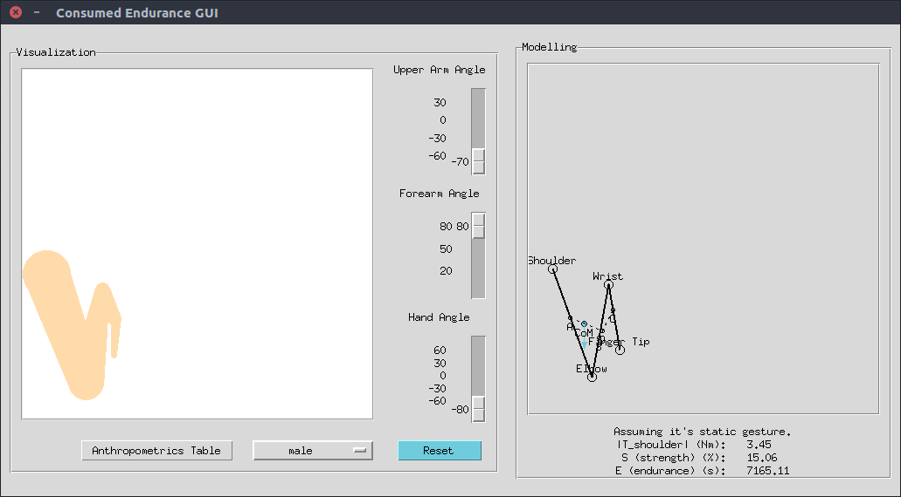

Two metric defined for arm fatigue defined in [@arm_fatigue] are strength and endurance.

[Consume Endurance](http://hci.cs.umanitoba.ca/projects-and-research/details/ce)

Strength
\[
S(T_{shoulder}) = 100 ⋅ \frac{T_{shoulder}}{T_{max}}
\label{strength}
\tag{1}
\]

Endurance
\[
E(T_{shoulder}) = \frac{1236.5}{(S(T_{shoulder}) - 15)^{0.618}} - 72.5
\label{endurance}
\tag{2}
\]

The magnitude of the torque for static arm is
\[
\begin{aligned}
T_{shoulder} & = \|𝐓_{shoulder}\| \\
& = \|𝐫×m𝐠\| \\
& = m r_x g
\end{aligned}
\label{torque}
\tag{3}
\]

where

* \(𝐫=[r_x,r_y]\) is a vector pointing to the *center of mass* of the arm.
* \(m\) the total mass of the arm.
* \(𝐠=[0,g]\) is gravitation vector where \(g=9.81\) is the magnitude of the gravitational acceleration.

Numerical values for the parameters are

<!-- Center of mass

\[
𝐫=𝐚+\frac{m_2+m_3}{m}(𝐝-𝐚) \\
𝐝=𝐛+\frac{m_3}{m_2+m_3}(𝐜-𝐛)
\]

... -->

---

The endurance can be plotted as a function of the percentual strength of the maximum using as seen from equation \(\eqref{endurance}\). The function increases asymptotically towards infinity as the percentual strength approaches \(15\).

\[
\begin{aligned}
S(T_{shoulder})&=15 \\
r_x &= \frac{15}{100} \frac{T_{max}}{mg}
\end{aligned}
\label{sweetpoint}
\tag{4}
\]

TODO: numerical values?

---

In order to maximimize the endurance time \(\eqref{endurance}\) the magnitude of the torque \(\eqref{torque}\) must be minimized. The only variable that can be effected is the center of mass. Bringing the arm as close to the body will minimize the \(x\) component of the center of mass and therefore minimize the total torque on the shoulder.

---

Loading the hand with a weight can be modelled by adding the mass of the weight \(m_w\) to the total mass of the arm \(m\).

## References
