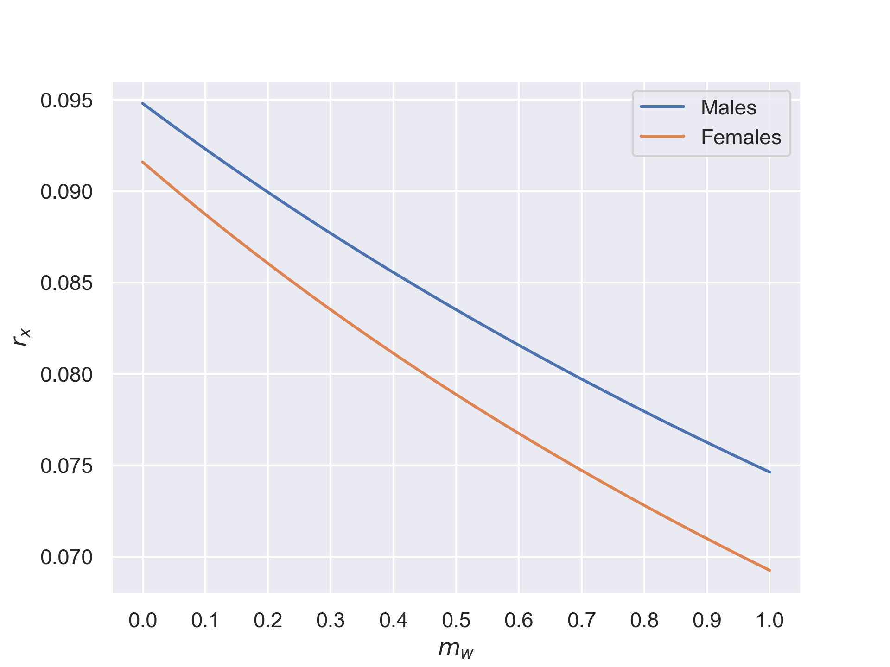

There are three metrics defined for arm fatigue defined in [@arm_fatigue]. This report considers two of them, strength and endurance. [Consume Endurance](http://hci.cs.umanitoba.ca/projects-and-research/details/ce)

Strength is defined
\[
S(T_{shoulder}) = 100 ⋅ \frac{T_{shoulder}}{T_{max}}.
\label{strength}
\tag{1}
\]

Endurance is defined
\[
E(T_{shoulder}) = \frac{1236.5}{(S(T_{shoulder}) - 15)^{0.618}} - 72.5.
\label{endurance}
\tag{2}
\]

The magnitude of the torque for static arm is
\[
\begin{aligned}
T_{shoulder} & = \|𝐓_{shoulder}\| \\
& = \|𝐫×m𝐠\| \\
& = m r_x g
\end{aligned},
\label{torque}
\tag{3}
\]

where

* \(𝐫=[r_x,r_y]\) is a vector pointing to the *center of mass* of the arm.
* \(m\) the total mass of the arm.
* \(𝐠=[0,g]\) is gravitation vector where \(g=9.81\) is the magnitude of the gravitational acceleration.

Numerical values for the parameters are

---

The endurance can be plotted as a function of the percentual strength of the maximum using as seen from equation \(\eqref{endurance}\). The function increases asymptotically towards infinity as the percentual strength approaches \(15\). The \(x\) component of the center of mass can be solved for this point:

\[
\begin{aligned}
S(T_{shoulder}) &= 15 \\
r_x &= \frac{15}{100} \frac{T_{max}}{mg}
\end{aligned}
\label{sweetpoint}
\tag{4}
\]

Then the numerical values are

1) For males:
\[
r_x = \frac{15}{100} ⋅ \frac{22.94}{(2.1+1.2+0.4) ⋅ 9.81} ≈ 0.095.
\]
2) For females:
\[
r_x = \frac{15}{100} ⋅ \frac{18.57}{(1.7+1.0+0.4) ⋅ 9.81} ≈ 0.092.
\]

---

In order to maximize the endurance time \(\eqref{endurance}\) the magnitude of the torque \(\eqref{torque}\) must be minimized. The only variable that can be affected is the center of mass. Bringing the arm as close to the body will minimize the \(x\) component of the center of mass and therefore minimize the total torque on the shoulder.

---

Loading the hand with a weight can be modeled by adding the mass of the weight \(m_w\) to the total mass of the arm \(m\) and calculated using \(\eqref{sweetpoint}\).

## References
